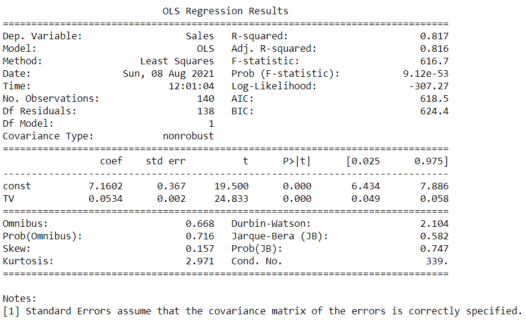

# Sales-Prediction-using-Linear-Regression
Model to predict sales of a company using linear regression.

## How the code works?
1. Load the sales dataset, with 200+ instances and 3 features.
2. Preprocess the data values.
3. Visualize the data values using boxplot and scatterplot.
4. Train the regression model.
5. Make predictions on the testing data.

## File wise explaination:

1. Sales Prediction using Linear Regression.ipynb : to preprocess, analyse, visualize and build model for the data.
2. advertising.csv : file containing data values.

## Result Snippet:

